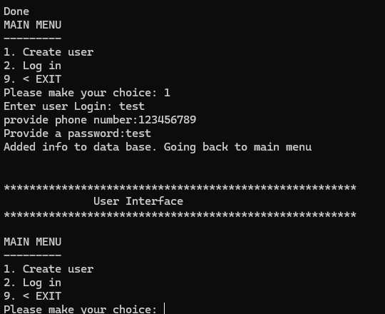
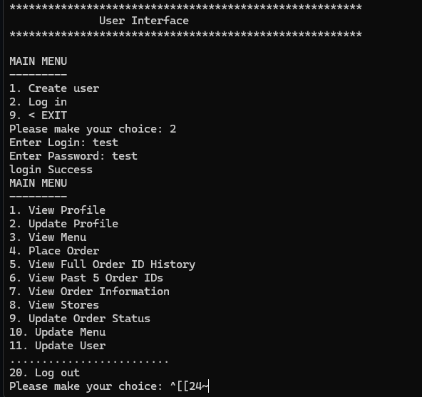
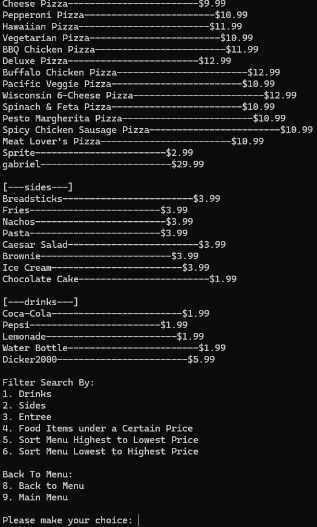
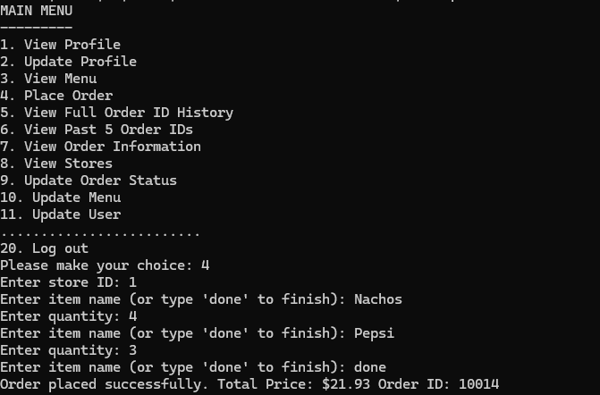
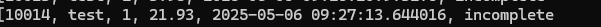

# 🍕 Pizza Store Management System

A Java-based pizza store simulation with PostgreSQL backend and role-based access control. The system supports account creation, login for returning users, order placement and tracking, and administrative tools for drivers and managers.

## ✨ Features

### 👤 Authentication
- Secure login system for returning users
- New user registration with role assignment by default as customer
- if your a manager, you can edit/modify each users role

### 🧾 Customer
- Create a new pizza order
- View current and past order status

### 🚚 Delivery Driver
- View assigned deliveries
- Update order status (e.g., "Out for Delivery", "Delivered")

### 🛠️ Manager
- Add, update, or remove menu items
- Modify item attributes (price, ingredients, etc.)
- View and manage all store orders
- Change roles for existing users (e.g., promote a driver to manager)

## 🛠 Tech Stack

- **Java** – Backend logic and console interface
- **PostgreSQL** – Relational database for storing users, orders, and menu items
- **JDBC** – Java Database Connectivity for SQL interaction

## 🔐 Role-Based Access Control

| Role       | Capabilities                                               |
|------------|------------------------------------------------------------|
| Customer   | Place orders, view order status                            |
| Driver     | View and update delivery status                            |
| Manager    | Full access: manage menu, orders, and user roles           |

## New User Account

## User authentication and home Menu

## Menu with Entree,sides, and drinks based on price

## Place an order based on Store ID. 

## View order history and status

